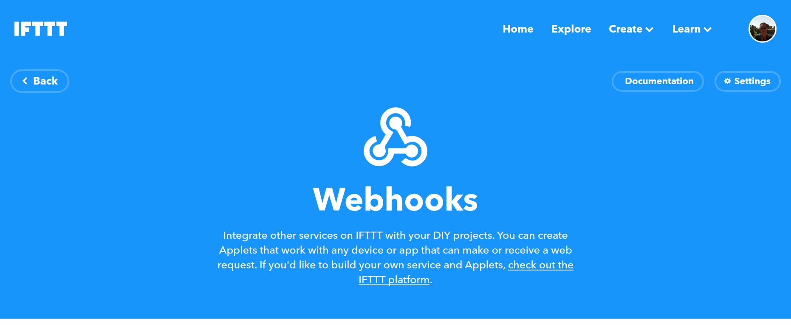

# catgenie

This application allows to fire an [IFTTT](https://ifttt.com/) trigger when a 
[CatGenie](https://www.catgenie.com/) code 2 error occurs.

The app needs:
- An Audio Input (e.g. microphone) to monitor for beep sounds. Obviously, the sensor must be close enough 
to your CatGenie.
- A [Maker Webhooks](https://ifttt.com/maker_webhooks) secret key

## Original use case

My CatGenie is dysfunctionnal. On each cleaning cycle, it fails 3 times with code 2 error. I think its solenoid valve 
is dead. Each time the code 2 error occurs, the CatGenie pauses the cycle
and loudly beeps until you fix the issue. In my case, until the valve is changed, I just have to push the start/pause 
button for 7 seconds to resume the cycle. I have to repeat that 2 or 3 times per cycle. It can happen at night or when 
I am out of the house.

I wanted to automate the push button action. So I ordered a [SwitchBot](https://www.switch-bot.com/bot). 
A [SwitchBot](https://www.switch-bot.com/bot) is just a remote button pusher. I discovered it was 
[IFTTT](https://ifttt.com/) compatible. The [SwitchBot](https://www.switch-bot.com/bot) was attached to the CatGenie 
*start/pause* button.

This application acts as an [IFTTT](https://ifttt.com/) trigger.

I created an [IFTTT](https://ifttt.com/) applet which, on *catgenie_error_2* webhook event, orders the 
[SwitchBot](https://www.switch-bot.com/bot) to press the *start/pause* button for 7 seconds.

The result in action:
[](https://youtu.be/m6DJ4pzsdfM)

Now I can sleep.

## How it works

The application monitors the selected audio input for beep sounds.  
When the code 2 error happens, the CatGenie emits 
[sequence of 2 beeps sound at a regular interval](src/test/resources/catgenie_error_2.wav).    
Something like: `beep, beep, long pause, beep, beep, long pause, beep, beep, long pause, ...`  
We name *burst* the 2 subsequent beeps happening between long pauses.
The sequence is now: `burst, long pause, burst, long pause, burst, ...`

When `burst long_pause burst` sequence part is successfully identified, the application fires 
[Maker Webhooks](https://ifttt.com/maker_webhooks) with event *catgenie_error_2*.  
Until there is no more beep sound, the event will be fired at a rate of at most one event every 2 minutes.

## Configuration

Configuration is read from `~/.catgenie/configuration.properties`. You must create the file yourself.

```properties
# The regex that the monitored Audio Input name will have to match
# In this example, we are looking for the Logitech C920 Audio Input
audio-input-name-regex=.*C920.*
# The secret key provided by https://ifttt.com/maker_webhooks
ifttt-webhook-key=secret
```

## How to retrieve Maker Webhooks secret key?

Go to [https://ifttt.com/maker_webhooks](https://ifttt.com/maker_webhooks).  
You should land on the following page:



Click on the button named *Documentation*.  
You should land on a page showing your secret key.

## What the code 2 error sound looks like?

You can play [catgenie_error_2.wav](src/test/resources/catgenie_error_2.wav) to know :)

## Tests

This app has been tested using:
- a Logitech C920 as audio input 
- a CatGenie 120
